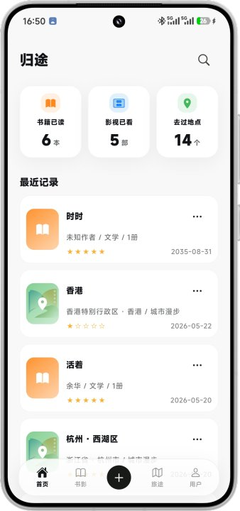
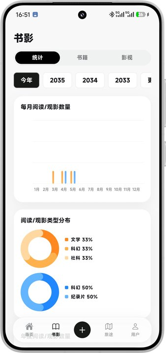
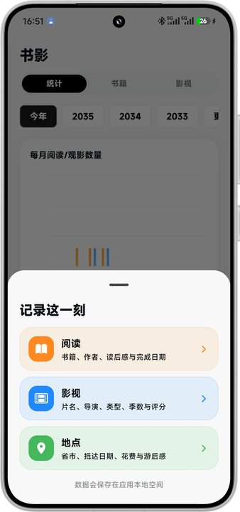
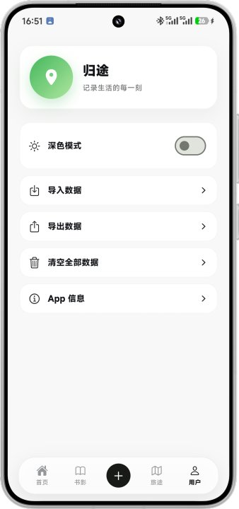

<p align="center">
  
</p>

<h1 align="center">归途</h1>

<p align="center">记录阅读、影视与旅途的 Flutter 移动应用</p>

<p align="center">
  
  
  
  
</p>

## 项目简介

归途是一款以个人记录为核心的 Android App，用于整理读过的书、看过的影视作品和去过的地点。项目采用本地优先设计，不需要注册账号，也不依赖远程业务服务。

这是我的首个完整 Flutter 练习项目，重点实践移动端界面、状态管理、本地持久化、数据统计、自定义绘制和 Android 打包流程。公开源码仓库不包含第三方地图数据，完整安装包内置地图以保证应用体验。

## 项目特点

- 中文界面，面向个人日常记录场景。
- 阅读、影视和旅途数据集中管理。
- 数据默认保存在本机，不要求登录或上传云端。
- 使用自定义绘制完成统计图表与省级足迹地图，发布安装包内置地图数据以保证旅途页正常展示。
- 同时支持浅色模式、深色模式和 JSON 数据备份。

## 界面预览

| 首页 | 书影统计 |
| --- | --- |
|  |  |

| 新增记录 | 用户设置 |
| --- | --- |
|  |  |

## 功能

- 首页概览：展示阅读、影视、地点数量和最近记录。
- 阅读记录：保存名称、作者、类型、日期、评分和备注。
- 影视记录：保存名称、类型、日期、评分和备注。
- 旅途记录：保存省份、城市、日期和旅行备注。
- 数据统计：柱状图、环形图、趋势折线图和省级足迹地图。
- 深色模式：支持浅色与深色主题切换。
- 数据管理：支持 JSON 导入、导出和清空全部数据。
- 离线使用：业务数据保存在 Android 应用私有目录。

## 技术栈

- Flutter / Dart
- Material 与 Cupertino 组件
- CustomPainter 自定义图表与地图绘制
- MethodChannel 调用 Android 原生文件能力
- Flutter Test

## 项目结构

```text
lib/
├─ main.dart                  # 页面导航与主要界面
├─ models/                    # 数据模型和演示数据
├─ services/                  # 本地存储与导入导出
└─ ui/                        # 表单、图表和地图绘制

assets/
├─ data/                      # 私有地图数据说明，公开源码不包含 GeoJSON
└─ images/                    # App 图标

docs/screenshots/             # README 界面截图
test/                         # Widget 与地图数据测试
android/                      # Android 原生工程
```

## 下载体验

Android 安装包可在仓库的 [Releases](https://github.com/SySH-7/guitu/releases) 页面下载。当前完整安装包内置地图数据，安装后旅途页可以正常显示省级足迹地图。

源码仓库不包含第三方 GeoJSON。使用源码自行运行时，如未在 `assets/data/` 中配置兼容地图数据，旅途页会显示“地图数据未配置”，阅读、影视、统计、导入导出等其他功能不受影响。

## 本地运行

环境要求：

- Flutter 3.24 或兼容版本
- Dart 3.5 或兼容版本
- Android Studio、Android SDK 或一台已开启 USB 调试的 Android 设备

```bash
flutter pub get
flutter doctor
flutter run
```

使用 VS Code 时，安装 Flutter 扩展，启动 Android 模拟器或连接手机，然后打开 `lib/main.dart` 并按 `F5`。

公开源码不包含第三方 GeoJSON。使用源码自行运行时，如未在 `assets/data/` 中配置兼容地图数据，其他功能仍可正常运行，旅途页会显示“地图数据未配置”。项目发布的完整安装包会内置地图数据，用于保证应用内省级足迹地图正常展示。

## 测试

```bash
flutter analyze
flutter test
```

## 构建 APK

```bash
flutter build apk --debug
```

构建结果位于：

```text
build/app/outputs/flutter-apk/
```

正式签名构建需要在本机配置 `android/key.properties` 和私有 keystore。可直接安装的公开版本请前往仓库的 **Releases** 页面下载。

### 从旧版升级

早期 `0.2.1` APK 使用过调试签名，无法直接覆盖安装当前正式签名版本。已经使用旧版并保存数据时，请按以下顺序操作：

1. 在旧版“用户”页面导出 JSON 数据。
2. 确认导出的 JSON 文件已经保存到设备可访问的位置。
3. 卸载旧版。
4. 安装 Releases 中的正式签名 APK。
5. 在新版“用户”页面导入此前导出的 JSON 数据。

从本次正式签名版本开始，后续版本应始终使用同一份私有 keystore 签名，才能正常覆盖升级。

## 隐私与数据

- App 不要求注册账号。
- App 不包含广告、行为追踪或远程统计服务。
- 记录数据默认保存在 Android 应用私有目录。
- 导入和导出操作由用户主动触发。

## AI 协作开发说明

本项目在开发过程中使用了 Codex 等 AI 编程工具辅助完成需求梳理、代码实现、问题排查和文档整理。项目功能取舍、界面要求、代码审查、地图数据核验、测试验证和最终发布由项目作者负责。

加入本说明是为了如实记录开发方式。AI 工具是开发辅助，不代表项目未经人工审查，也不改变作者对本仓库内容和发布结果的责任。

## 地图与第三方数据说明

出于第三方数据授权与地图合规考虑，公开源码仓库不包含 `china_provinces.geojson`。发布安装包可在不公开源数据文件的前提下内置地图数据，用于保证应用内省级足迹地图正常展示。本地私有开发时可自行在 `assets/data/` 中配置兼容的 GeoJSON，相关说明见 [THIRD_PARTY_NOTICES.md](THIRD_PARTY_NOTICES.md)。

本项目属于个人学习与技术展示作品，不是官方地图产品，也不提供导航、定位或互联网地图服务。源码仓库中的地图绘制代码只做屏幕适配所需的等比例渲染，不修改原始地图数据文件。免责声明不能替代法律法规要求；公开传播地图数据、二次发布含地图的构建或商业使用前，使用者应自行确认地图审核、数据授权和其他合规要求。

## 开源许可

除第三方地图数据外，项目代码采用 [MIT License](LICENSE) 开源。
